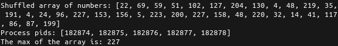
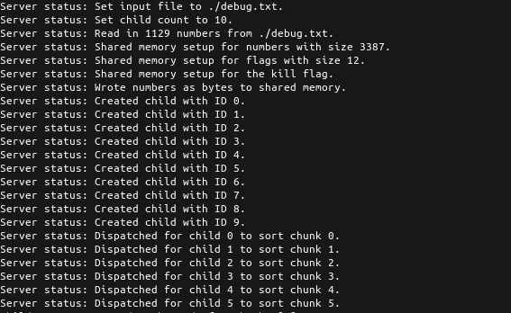
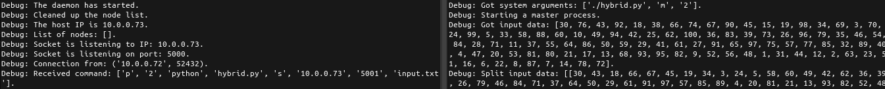
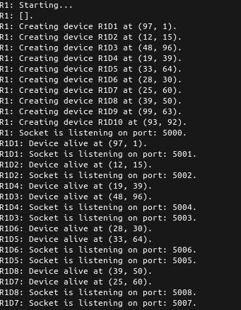

# Networking

Various small Python projects done for a networking class.

The first three were assignments. The last two were tests.

## 1. Shared Chat

This program uses shared OS memory to send "chat" messages between two window clients.

To run: `python3 ./client.py`

## 2. Shared Max

This program uses forked processes to sort numbers and return the max.

To run: `python3 ./max.py [child count]`

## 3. Shared Sort

This program uses forked processes and shared memory to sort numbers and return the sorted list.

The input file is expected to be space delimited numbers.

To run: `python3 ./sort.py [input file] [child count]`

## 4. Daemon Sort

This program features a daemon, and a hybrid master slave process to sort text files on a shared folder.

To run: `python3 ./daemon.py` on two computers on the same network, sharing the same folder.

And: `python3 ./hybrid.py m 2` to run a (m)aster process with two slaves.

## 5. Device Network

This program features routers that create devices, that create routing tables to each other.

To run: `python3 ./router.py 10 50 0,100,0,100`

Where the options are `[device count] [device strength] [startx],[maxx],[starty],[maxy]`.

## License

https://creativecommons.org/licenses/by/4.0/